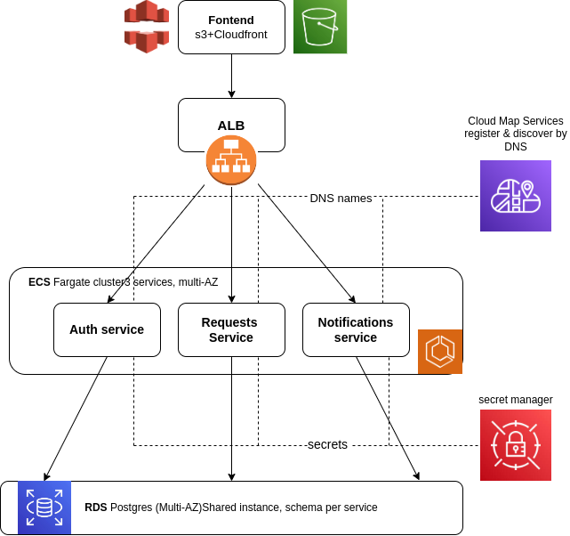

# SMMB Maintenance System — AWS Solutions Architect Graduation Project

## Local quick start

This repository now contains a runnable local vertical slice of the target
architecture. The three TypeScript services keep data in memory in local mode;
their HTTP contracts are the same boundaries intended for RDS, Redis, and SES
in AWS.

```bash
npm install
npm run dev:notifications
npm run dev:auth
npm run dev:requests
npm run dev:frontend
```

Open `http://localhost:5173`. Demo credentials are `client1` / `password123`.
The API health endpoints are available at ports `4000`, `4001`, and `4002`.

The frontend uses the Vite `/api` proxy by default. This keeps browser requests
same-origin while Vite forwards them to the LocalStack ALB. Start it with:

```bash
npm run dev:frontend
```

Run the contract smoke test while the three services are running:

```bash
npm run test:smoke
```

The local implementation includes login and user lookup in Auth, request
creation plus guarded lifecycle transitions in Requests, and status-change
notification logging in Notifications. Docker Compose starts the same three
services without requiring AWS credentials.

A role-based facility maintenance request system (React/TypeScript frontend)
being re-architected from a single-page mock app into three independently
deployable microservices — **Auth**, **Requests**, and **Notifications** —
running on Amazon ECS Fargate, as required by the "Containerized
Microservices with ECS Fargate and Service Discovery" project brief.

Author: [Your name] · [your email] · [LinkedIn]

## Problem statement

The current app (see [Original App Overview](#original-app-overview) below)
handles the full lifecycle of a maintenance request — client submission,
director approval, manager assignment, worker execution, and client
confirmation — but everything lives client-side: an in-memory mock user
database, tokens in `localStorage`, and no real backend. This project
rebuilds it as three containerized backend services with a real database,
real JWT auth, shared session caching, secrets management, service
discovery, and a blue/green CI/CD pipeline — while keeping the existing
React frontend and its role-based UI largely as-is.

## Service mapping

The app's existing feature set splits cleanly onto the three required
microservices:

| Fargate service | Responsibility | Replaces / builds on |
|---|---|---|
| **Auth** | Login, JWT issuance & verification, user CRUD, password hashing, role checks | `AuthContext` + `AuthService` singleton (currently mock, in-memory) |
| **Requests** | Maintenance request workflow: create, accept/refuse, assign, intervention reports, replacement parts, client confirmation | `RequestForm`, `RequestList`, `InterventionForm`, `ConfirmationModal` |
| **Notifications** | Sends email/in-app alerts on status changes (pending→accepted, assigned, completed, etc.) | Listed as a "Future Enhancement" in the original app — now a first-class service |

## Architecture

**Diagram:** 



### Request routing & service discovery
The React app is built as static assets and served from **S3 + CloudFront**
— it does not run on Fargate. It calls an **ALB**, which routes by path
(`/api/auth`, `/api/requests`, `/api/notifications`) to the matching ECS
Fargate service. All three services register with **AWS Cloud Map** so they
can call each other by DNS name instead of hardcoded URLs — e.g. Requests
looks up Auth's internal endpoint to fetch the active worker list for
assignment, and calls Notifications whenever a request's status changes.

### Data & secrets
**Secrets Manager** injects the database connection string and JWT signing
secret into all three services at task startup — nothing sensitive ships in
the image or task definition. Auth, Requests, and Notifications each own a
separate schema in one shared **RDS Postgres (Multi-AZ)** instance (a single
instance keeps cost down for a portfolio project; splitting into
per-service databases is a reasonable stretch goal). Auth also uses
**ElastiCache Redis** to cache sessions/refresh tokens so a token can be
revoked without a database round trip. Notifications calls **Amazon SES**
to actually send the emails.

### CI/CD
CodePipeline → CodeBuild (build, test, push scanned image to ECR) →
CodeDeploy blue/green onto the target ECS service, with automatic rollback
if health checks fail. X-Ray traces requests across all three services —
useful for spotting a slow Requests→Notifications call after a deploy.

## What changes from the current (mock) implementation

| Current | Target |
|---|---|
| In-memory user DB in `AuthService` | Real `users` table in RDS, owned by the Auth service |
| Session in `localStorage`, mock token | Real JWT issued by Auth; refresh/session state in ElastiCache |
| bcrypt hashing (already correct) | Unchanged — just moves server-side into the Auth service |
| No real backend for requests | `requests` + `replacement_parts` tables owned by the Requests service |
| No notifications | New Notifications service, triggered by Requests on status transitions, sending via SES |
| Hardcoded nothing sensitive yet, but no secrets infra | Secrets Manager for DB creds & JWT secret |

## AWS services used

| Service | Role |
|---|---|
| ECS Fargate | Runs Auth, Requests, and Notifications as serverless containers |
| ECR | Private image registry, vulnerability scanning on push |
| Application Load Balancer | Path-based routing to each service's target group |
| AWS Cloud Map | DNS-based service discovery for service-to-service calls |
| RDS Postgres (Multi-AZ) | Persistent storage — users, requests, replacement parts, notification log |
| ElastiCache (Redis) | Session/refresh-token cache for Auth |
| Secrets Manager | DB credentials and JWT signing secret, injected at runtime |
| Amazon SES | Sends status-change emails from the Notifications service |
| S3 + CloudFront | Hosts and serves the React/Vite frontend build |
| CodePipeline + CodeBuild + CodeDeploy | CI/CD with blue/green deployment and automatic rollback |
| X-Ray | Distributed tracing and service map across the three services |

## IAM roles

- **Task execution role** — pulls images from ECR, writes logs to
  CloudWatch, and reads the specific Secrets Manager ARNs each service needs.
- **Task role** — scoped to what the application code itself needs at
  runtime (e.g. Notifications' task role can call SES; Auth's cannot).
  Kept separate from the execution role.
- Each service's task role is scoped only to its own RDS schema credentials
  and its own secrets — Requests has no access to the JWT signing secret,
  for example.

## Security considerations

- No hardcoded credentials — everything sensitive comes from Secrets Manager.
- ECS tasks and RDS/ElastiCache sit in private subnets with no public IPs;
  only the ALB and CloudFront are internet-facing.
- Security groups scoped per tier: ALB → ECS on the service port only;
  ECS → RDS on 5432 only; ECS → ElastiCache on 6379 only.
- ECR vulnerability scanning blocks known-CVE images from deploying.
- JWTs are short-lived; refresh tokens are revocable via the ElastiCache
  blacklist.

## Cost considerations

- Fargate bills per vCPU/memory-second — right-size the three task
  definitions individually (Notifications likely needs far less than Requests).
- RDS Multi-AZ and ElastiCache are billed hourly regardless of traffic —
  fine for a demo, but scale down or tear down when not presenting.
- Use VPC endpoints for ECR, Secrets Manager, and CloudWatch Logs instead
  of routing through a NAT Gateway, to avoid NAT data-processing charges.
- SES and CloudFront costs are usage-based and negligible at demo volume.

## Repository structure

```
.
├── README.md
├── docs/
│   ├── architecture-runtime.png
│   └── architecture-data.png
├── frontend/                # existing React/Vite/Tailwind app (see below)
├── services/
│   ├── auth/
│   ├── requests/
│   └── notifications/
├── infrastructure/          # CloudFormation / CDK / Terraform
├── buildspec.yml
└── appspec.yml
```

## Deployment

*(Fill in once implemented — stack name/parameters, one-time setup like
creating the Cloud Map namespace, RDS schemas, and SES domain verification.)*

## Learning outcomes demonstrated

- Built and pushed Docker images to ECR for three independent services.
- Designed ECS Fargate services with separate, least-privilege task and
  execution IAM roles per service.
- Implemented service-to-service calls (Requests → Auth, Requests →
  Notifications) via Cloud Map DNS-based discovery.
- Configured ALB path-based routing across three target groups.
- Set up CodeDeploy blue/green deployment integrated with ECS, with
  automatic rollback.
- Replaced a mock, client-side auth flow with real JWT issuance/verification
  and Secrets Manager-backed credential injection.

## Demo

*(Optional — link a recorded video or live URL here.)*

---

## Original App Overview

*(Preserved from the pre-AWS version of this project for reference.)*

### Features
- Username/password login, session persistence, role-based access control
- Request creation, director approval/refusal, worker assignment,
  intervention reports, client confirmation with digital signature
- User management dashboard (create/edit/deactivate, password strength rules)

### User roles

| Role | Key actions |
|---|---|
| Client | Create requests, view status, confirm completed work |
| Director | Accept or refuse pending requests |
| Manager | Assign workers, fill intervention reports, manage users |
| Worker | View assigned tasks, perform maintenance work |

### Request workflow

```
pending → accepted → assigned → in-progress → completed → confirmed
   ↓
refused
```

### Tech stack (frontend)

| Technology | Purpose |
|---|---|
| React 18 | UI framework |
| TypeScript | Type safety |
| Vite | Build tool / dev server |
| Tailwind CSS 3 | Styling |
| Lucide React | Icons |
| bcryptjs | Password hashing (moves server-side in the new Auth service) |
| jsonwebtoken | JWT support (moves server-side in the new Auth service) |
| uuid | Unique ID generation |

### Demo accounts (mock mode)

All demo accounts use the password `password123`:

| Role | Username(s) |
|---|---|
| Manager | `manager` |
| Director | `director` |
| Client | `client1`–`client5` |
| Worker | `worker1`–`worker8` |

### Data models

**MaintenanceRequest** — `id`, `status`, `createdAt`, `location`,
`requester`, `phoneNumber`, `urgencyLevel`, `interventionNature[]`,
`otherNature?`, `problemDescription`, `additionalObservations?`,
`assignedWorker?`, `rejectionReason?`, `workPerformed?`, `difficulties?`,
`replacementParts[]?`, `warehouseStaff?`, `interventionPersonnel?`,
`smmbResponsible?`, `internalNotes?`, `clientConfirmation?`,
`confirmationDate?`

**ReplacementPart** — `id`, `designation`, `reference`, `quantity`

**User** — `id`, `username`, `password` (hashed), `role`, `fullName`,
`email`, `isActive`, `createdAt`, `lastLogin?`